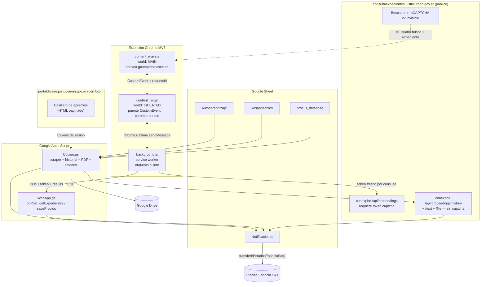
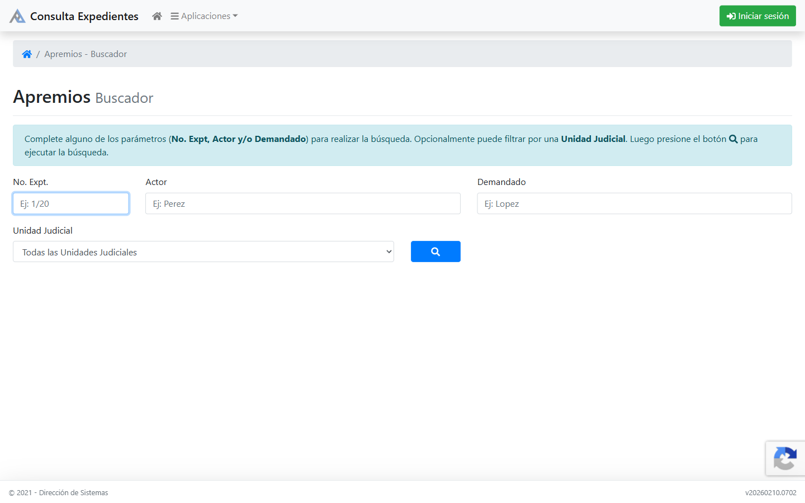

# Gestor de Notificaciones Judiciales — Tucumán

Automatización end‑to‑end que centraliza en una Google Sheet las notificaciones diarias
del Poder Judicial de Tucumán: hace login en el portal, scrapea las notificaciones del día,
resuelve el ID interno de cada expediente contra una API protegida por reCAPTCHA invisible,
baja el historial y los PDF adjuntos, y autoasigna el estado procesal de cada causa.

Tres piezas: **Google Apps Script** (orquestador + scraper + Web App),
**extensión de Chrome MV3** (puente de reCAPTCHA) y **Google Sheets** como interfaz de usuario.

> **English summary** — End‑to‑end automation that centralizes the daily court notifications
> of the Judiciary of Tucumán (Argentina) into a Google Sheet. It logs into the court portal,
> scrapes the day's notifications, resolves each case's internal ID against a
> reCAPTCHA-protected API, fetches case history and PDF attachments, and auto‑assigns the procedural
> status of each case. Built with Google Apps Script, a Manifest V3 Chrome extension and
> Google Sheets as the UI. The interesting part is the **reCAPTCHA bridge** (see
> [Cómo se resuelve el reCAPTCHA](#cómo-se-resuelve-el-recaptcha)): no captcha is broken —
> the extension re‑uses the site's own `grecaptcha` instance inside the user's authenticated
> session to mint one fresh token per query.

---

## El problema

Un estudio jurídico que lleva juicios de apremio recibe todos los días una tanda de
notificaciones judiciales en el portal del SAE (Sistema de Administración de Expedientes).
El flujo manual era:

1. Entrar al portal, mirar la tanda del día (podían ser 10 o 60 notificaciones).
2. Por cada expediente, abrir el buscador público de Consulta de Expedientes,
   **resolver un captcha**, buscar el número de expediente y abrir la ficha.
3. Leer la última entrada del historial para entender qué pasó.
4. Descargar el PDF de la actuación.
5. Anotar a mano en una planilla el estado procesal resultante y a qué abogado del
   estudio le corresponde ese expediente.

Entre una y dos horas por día, todos los días, con errores de transcripción y
expedientes que se pasaban por alto.

## El resultado

Un solo Sheet donde cada mañana aparece la tanda del día ya cruzada, con:

| Lo que antes era manual | Lo que hace el sistema |
|---|---|
| Login + navegar la tabla paginada | `hacerLogin()` + `etapaScrape()` |
| Resolver captcha por cada expediente | Extensión Chrome: un token de reCAPTCHA por consulta, sin intervención |
| Buscar el `procID` interno de cada causa | Web App + API `/api/proceedings` |
| Leer la última entrada del historial | `obtenerHistorialYAdjuntoCercanoHoyPorProcID()` |
| Bajar el PDF y guardarlo | `descargarPDFADrive()` + `obtenerTextoYGenerarPDF()` |
| Decidir el estado procesal | `asignarEstadosFinal()` sobre la tabla de Autoaprendizaje |
| Saber de quién es el expediente | `cargarResponsables()` con `IMPORTRANGE` a la planilla del estudio |
| Pasar los estados al tablero del estudio | `transferirEstadosEspacioSat()` |

Corre solo a las 3:00 AM por un trigger diario. A las 9 de la mañana la planilla ya está lista.


*Hoja `Notificaciones`. Los nombres de los responsables están anonimizados (`RESP. A` … `RESP. D`);
el resto de los datos es real.*

---

## Arquitectura



El sistema toca **tres superficies distintas del Poder Judicial**, cada una con su
mecanismo de acceso propio. Eso es lo que hace interesante el problema: no hay una API
única, hay que pegar tres mundos.

---

## Extracción de datos: las tres fuentes

### 1. Portal del SAE — scraping con sesión autenticada

El casillero de notificaciones vive detrás de un login Laravel. Apps Script no tiene
navegador, así que `hacerLogin()` reproduce el flujo a mano con `UrlFetchApp`:

```javascript
// GET al form → cookies iniciales + token CSRF embebido en el HTML
const csrfMatch = htmlLogin.match(/name=["']_token["']\s+value=["']([^"']+)["']/i);

// POST de credenciales con las cookies y el CSRF
const payload = '_token=' + encodeURIComponent(csrf) + '&username=…&password=…';

// El login responde 302: seguir hasta 5 redirects a mano,
// acumulando cookies en cada salto (followRedirects: false)
```

`followRedirects: false` es la clave: si se deja que `UrlFetchApp` siga los redirects
automáticamente, se pierden las cookies que cada salto va emitiendo y la sesión
nunca queda armada. El loop de 5 redirects acumula y mergea `Set-Cookie` paso a paso.

Con la sesión lista, `etapaScrape()` recorre la tabla paginada y la parsea con regex
(`parsearTabla()` / `limpiarHtml()`) — sin librerías de DOM, porque Apps Script no tiene.
El scraper **se detiene en cuanto ve una fecha distinta a la del día objetivo**: solo
interesa la tanda más reciente, no el histórico entero.

Las credenciales se cargan una vez desde el menú y viven en `ScriptProperties`,
nunca en el código.

### 2. Consulta de Expedientes — la API detrás del reCAPTCHA

El portal del SAE da el número de expediente (`2821/26`) pero no el `procID`, que es
el identificador interno con el que se consulta todo lo demás. Ese `procID` solo se
obtiene del buscador público, y ese buscador está protegido por reCAPTCHA invisible:

```
GET https://conexpbe.justucuman.gov.ar/api/proceedings
      ?jurisdiction=18&page=1&number=2821/26&captcha=<TOKEN_RECAPTCHA>
```

Sin un token válido, la API responde 404 con `message` mencionando el captcha.
Esta es la parte central del proyecto y tiene su propia sección más abajo.



*El buscador público de Apremios. El badge de reCAPTCHA abajo a la derecha es toda la
pista visible: el desafío es invisible hasta que Google decide que no lo sea.*

### 3. Historial, texto y adjuntos — API abierta

Una vez que se tiene el `procID`, el resto de los endpoints **no piden captcha**;
alcanza con mandar `Origin` y `Referer` del sitio:

| Endpoint | Devuelve | Uso |
|---|---|---|
| `/api/proceedings/history` | `stories[]` con fecha, descripción y adjuntos | Última entrada → columna I |
| `/api/proceedings/history/text` | Texto completo de la actuación | Se renderiza a PDF → columna J |
| `/api/proceedings/history/file` | Binario del adjunto | Se baja a Drive → columna K |

`obtenerHistorialYAdjuntoCercanoHoyPorProcID()` ordena las `stories` por fecha
descendente para la última entrada, pero para el adjunto elige **la story con archivo
cuya fecha esté más cerca de hoy**, que no siempre es la última: la notificación
del día suele ser un decreto sin archivo, y el PDF que interesa cuelga de una entrada
anterior.

El texto de la actuación no viene como PDF sino como HTML crudo. `obtenerTextoYGenerarPDF()`
lo envuelve en una plantilla que imita la vista del Poder Judicial (cabecera, caja de
firma digital, caja de certificado) y usa `Utilities.newBlob(...).getAs('application/pdf')`
para convertirlo. El resultado se sube a Drive con permiso de lectura por link y se
escribe en la celda como `=HYPERLINK(...)`.

---

## Cómo se resuelve el reCAPTCHA

> **Lo primero, porque importa:** acá no se rompe ningún captcha. No hay OCR, no hay
> servicio de resolución, no hay granja de tokens ni evasión de detección. El usuario
> está autenticado, hace **una** búsqueda real, y a partir de ahí la extensión le pide
> a la propia instancia de `grecaptcha` de la página — en la sesión del usuario, en el
> origen del sitio — un token nuevo por cada consulta que ese usuario ya tiene derecho
> a hacer. Lo que se automatiza es la repetición, no la verificación.

### El problema concreto

El buscador usa **reCAPTCHA v2 Invisible**. Se ve en el `<iframe>` que monta Google:

```
https://www.google.com/recaptcha/api2/anchor?ar=1&k=6LeIn2Is…
  &size=invisible&badge=bottomright&type=image&execute-ms=30000
```

No hay checkbox ni imágenes que resolver **mientras Google confíe en la sesión**: el sitio
llama a `grecaptcha.execute()`, Google evalúa el comportamiento y devuelve un token de un
solo uso con TTL de ~2 minutos, que viaja como query param. Si el análisis de riesgo
desconfía, `execute()` deja de ser silencioso y planta un desafío de imágenes — que en un
flujo desatendido significa que todo se frena.

Para resolver 30 expedientes hacen falta 30 búsquedas, cada una con su token.

### Intento 1 — interceptar y reusar el token (v1)

La primera versión interceptaba el token del request saliente y lo reusaba para todas
las consultas del lote:

```javascript
chrome.webRequest.onBeforeRequest.addListener(details => {
  const captcha = new URL(details.url).searchParams.get('captcha');
  // …reusar este token para los siguientes expedientes
}, { urls: ['*://conexpbe.justucuman.gov.ar/*'] });
```

Funcionaba —el token resultó reusable dentro de su TTL para distintos `number`— pero
tenía un techo duro: **~110 segundos de ventana**. Con el delay entre requests necesario
para no disparar el análisis de riesgo, entraban 8 o 10 expedientes por búsqueda manual.
Para 30 notificaciones el usuario tenía que volver al buscador 3 o 4 veces.

### Intento 2 — pedirle tokens frescos a la propia página (v2, el actual)

En vez de reusar un token, la extensión **genera uno nuevo por consulta** llamando a la
misma función que usa el sitio. El obstáculo es que los content scripts corren en un
*isolated world*: ven el DOM, pero no ven `window.grecaptcha`, que vive en el contexto
de la página. La solución es inyectar en el **MAIN world** (`"world": "MAIN"` en el
manifest) y hookear `grecaptcha.execute` para robarle los argumentos exactos:

```javascript
// content_main.js — corre en el contexto de la página
const origExecute = window.grecaptcha.execute;
window.grecaptcha.execute = function () {
  // El sitio puede llamar execute(siteKey, {action}), execute(widgetId, {action})
  // o execute({action}). No se asume la forma: se capturan los args tal cual.
  if (!capturedExecuteArgs) capturedExecuteArgs = Array.from(arguments);
  return origExecute.apply(this, arguments);
};
```

A partir de la primera búsqueda real del usuario, `capturedExecuteArgs` tiene la firma
exacta que el sitio usa. Generar un token nuevo es replicar esa llamada:

```javascript
const token = await window.grecaptcha.execute.apply(window.grecaptcha, capturedExecuteArgs);
```

### El puente entre los tres contextos

MV3 obliga a tres contextos aislados, cada uno con lo que el otro no tiene:

| Contexto | Ve `grecaptcha` | Ve `chrome.*` | Rol |
|---|---|---|---|
| `content_main.js` (MAIN) | ✅ | ❌ | Genera el token |
| `content_iso.js` (ISOLATED) | ❌ | ✅ | Puente |
| `background.js` (service worker) | ❌ | ✅ | Orquesta el lote |

MAIN e ISOLATED comparten el DOM, así que se hablan por `CustomEvent`. Cada pedido lleva
un `requestId` para correlacionar respuesta con pedido:

```
background            content_iso (ISOLATED)         content_main (MAIN)
    │                        │                              │
    ├─ REQUEST_FRESH_TOKEN ─►│                              │
    │                        ├─ SAE_PROCID_REQUEST_TOKEN ──►│
    │                        │                              ├─ grecaptcha.execute(...)
    │                        │◄── SAE_PROCID_TOKEN_RESPONSE ┤   { requestId, token }
    │◄── { success, token } ─┤                              │
    │                        │                              │
    └─ fetch /api/proceedings?...&captcha=<token>
```

Dos detalles que solo aparecen usando el sistema en producción:

- **Content script muerto.** Si se actualiza la extensión con la pestaña abierta, el
  content script queda huérfano y `sendMessage` tira `Receiving end does not exist`.
  El background detecta ese error y **re‑inyecta** ambos scripts con `chrome.scripting.executeScript`
  antes de reintentar. La inyección es idempotente: `content_main.js` chequea
  `grecaptcha.__sae_hooked` para no hookear dos veces.
- **Dos MAIN worlds respondiendo.** Tras una re‑inyección pueden convivir el closure viejo
  (con `capturedExecuteArgs` válidos) y el nuevo (vacío). El listener de ISOLATED
  **prefiere el token sobre el error**: si llega un error lo guarda como `lastError` pero
  sigue esperando hasta el timeout de 10s por si el otro MAIN responde con un token bueno.

### Cuidar la confianza, que es el recurso escaso

El recurso escaso no es la cuota de la API: es la confianza que Google le tiene a la
sesión. Un patrón de tráfico automatizado hace que `execute()` empiece a devolver
desafíos de imagen o tokens que el backend rechaza, y ahí el flujo desatendido se
termina. El diseño del lote gira alrededor de preservarla:

| Medida | Valor | Por qué |
|---|---|---|
| Delay entre consultas | 7 s | Ritmo humano; el servidor tolera 1000 req/h, el análisis de riesgo no |
| Tope por lote | 25 expedientes | Sesión acotada en vez de maratón |
| Corte ante rechazo | inmediato | Un 401/403/419/422 —o un 404 cuyo `message` menciona captcha— **detiene el lote**. No se reintenta: insistir después de un rechazo es exactamente el patrón que dispara el desafío |
| Deduplicación | cache por expediente y por número madre | Cada token que no se pide es una interacción menos con Google |
| Distinción 404 real vs 404 captcha | por `message` | Un expediente inexistente no debe abortar el lote |

```javascript
if (isCaptchaFail) {
  // No reintentar — detenerse inmediatamente para no quemar más score
  log('❌ Captcha fail en item ' + (i + 1) + ', deteniendo lote para preservar score');
  captchaExpirado = true;
  break;
}
```

Si el lote se corta, lo hace **con todo lo ya resuelto guardado**: la notificación de
Chrome dice cuántos se depositaron y cuántos faltan, y la próxima búsqueda del usuario
retoma exactamente donde quedó, porque el Web App solo devuelve las filas con la
columna A vacía.

---

## La regla de negocio que rompía todo: los incidentes

Durante la operación real el sistema resolvía 7 de cada 10 notificaciones. Las otras 3
quedaban sin `procID` y nadie entendía por qué. La explicación no estaba en el código
sino en cómo funciona un juzgado — llegó en un audio de WhatsApp del abogado
(transcripto en [`contexto/audio-incidentes-2026-08-27.md`](contexto/audio-incidentes-2026-08-27.md)):

> Un **incidente** es un expediente chico y separado, abierto por una cuestión puntual
> dentro de un expediente principal, para no frenar la marcha de éste. Se numeran
> `Q1`, `Q2`, `Q3`… sobre el **número madre** del principal.

Y el buscador del Poder Judicial **solo indexa el número madre**. Buscar `3831/26-Q1`
no devuelve nada; buscar `3831/26` devuelve el principal *y todos sus incidentes*.

El fix tiene dos mitades, y la segunda era un bug latente:

```javascript
// 1. Consultar siempre por el número madre
function expteBase(expte) {
  const m = expte.toString().trim().match(/^\s*(\d+\s*\/\s*\d+)/);
  return m ? m[1].replace(/\s+/g, '') : '';
}

// 2. Elegir por coincidencia EXACTA de nro_expediente, nunca data[0]:
//    el incidente suele venir primero que el principal en la respuesta.
const encontrados = {};
for (const reg of json.data) {
  encontrados[normalizarExpte(reg.nro_expediente)] = reg.procid;
}
const procid = encontrados[normalizarExpte(item.expte)];
```

Tomar `data[0]` habría asignado silenciosamente el `procID` del incidente al expediente
principal: los datos habrían entrado igual, pero mal. Y como beneficio lateral, una sola
consulta —un solo token de captcha— resuelve el principal y todos sus incidentes de una:
se indexa la respuesta completa en `busquedaCache[base]` y las filas siguientes salen
de ahí sin gastar token.

`testIncidentesQ1()` verifica ambas cosas contra datos reales de la planilla.

---

## Autoaprendizaje: cómo se decide el estado procesal

El estado procesal (`4.VER QUE LIBRE MANDAMIENTO`, `17.PLAZOS SUSPENDIDOS`, …) se deduce
de la combinación tipo de notificación + última entrada del historial. En vez de
hardcodear reglas, el sistema **aprende de lo que el abogado ya corrigió a mano**:

1. `asignarEstadosFinal()` recorre las filas del responsable objetivo y busca la clave
   `tipoEscrito || ultimaEntrada` en el mapa de Autoaprendizaje.
2. Si hay match, escribe el estado — **solo si la celda está vacía**. Nunca pisa una
   decisión humana.
3. `actualizarAutoaprendizaje()` corre al inicio de cada ejecución: recorre el histórico,
   junta las combinaciones nuevas que el abogado completó a mano y las agrega a la tabla.

El bucle se cierra solo: cada corrección manual se convierte en una regla que mañana
se aplica automáticamente. La columna E de la hoja funciona como **lista blanca**:
solo los estados que están ahí pueden autoasignarse, así una corrección puntual y rara
no se convierte en regla general.


*Hoja `Autoaprendizaje`. A la izquierda el par (notificación, última entrada) que actúa
como clave; a la derecha la lista blanca de estados autoasignables.*

---

## Resiliencia: sobrevivir al límite de 6 minutos

Apps Script mata cualquier ejecución a los 6 minutos. Una tanda grande —login, N páginas,
historial y PDF por fila— no entra. El script está construido como una **máquina de estados
con checkpoints**:

```javascript
CONFIG.MAX_EXEC_MS = 4 * 60 * 1000;   // margen de 2 min sobre el límite real

// state = { stage: 'scrape'|'historial', fechaObjetivo, paginaSiguiente,
//           filaInsertion, historialFilaActual }
// Serializado en ScriptProperties bajo RESUME_KEY
```

- Antes de cada página y de cada fila se chequea `tiempoAgotado()`.
- Si se agota, se guarda el `state` exacto y se programa un trigger a 1 minuto (`programarContinuacion()`).
- `continuarApremios()` levanta el `state` y sigue en el mismo punto: misma fecha objetivo,
  misma página, misma fila.
- Al terminar de verdad: `clearResumeState()` + borrar triggers de continuación.

Del lado del Web App valen las mismas ideas con otros nombres:

- **`LockService`** con `tryLock(5000)` — dos POST simultáneos no pueden pisarse filas.
- **Escritura inmediata + `flush()`** — cada `procID` se escribe apenas se resuelve, no al
  final del lote. Si el proceso muere, lo ya resuelto está en la planilla.
- **La planilla es la cola de trabajo** — `getExpedientes` devuelve solo filas con la
  columna A vacía. No hay estado duplicado que sincronizar: reintentar es idempotente.

---

## Estructura del repo

```
Codigo.gs                     Apps Script principal (~2000 líneas)
                                orquestador con resume state, scraper del portal,
                                historial, PDF a Drive, autoaprendizaje,
                                menú del Sheet y transferencia a Espacio SAT
WebApp.gs                     Web App (doPost): getExpedientes / saveProcids
                                autenticada por token compartido

sae-procid-extension-v2.0.0/
  manifest.json               MV3, content scripts en MAIN e ISOLATED
  content_main.js             hook de grecaptcha.execute + wrap de fetch/XHR
  content_iso.js              puente CustomEvent ↔ chrome.runtime
  background.js               service worker: orquesta el lote, dedup, rate limit
  popup.html / popup.js       configuración (URL del Web App + token)
  README.md                   instalación y troubleshooting

contexto/
  README.md                   modelo de datos de la planilla, hoja por hoja
  capturas/                   capturas de las tres hojas
  audio-incidentes-*.md       transcripción del audio que destrabó el bug de incidentes
```

La planilla tiene tres hojas visibles (`Notificaciones`, `Autoaprendizaje`, `Responsables`)
más `procID_database`, que el script crea solo como cache `expte → procID`.
El detalle columna por columna está en [`contexto/README.md`](contexto/README.md).


*Hoja `Responsables`: una columna por abogado, alimentada por `IMPORTRANGE` desde la
planilla maestra del estudio. `cargarResponsables()` arma el mapa `expte → responsable`,
con fallback al número madre para que los incidentes hereden el responsable del principal.*

---

## Puesta en marcha

### Apps Script

1. Copiar `Codigo.gs` y `WebApp.gs` al proyecto Apps Script vinculado a la planilla.
2. Recargar la planilla → aparece el menú **Notificaciones**.
3. **🔑 Actualizar credenciales de Log In** → usuario (CUIL) y contraseña del portal.
   Se guardan en `ScriptProperties`.
4. **👤 Configurar responsable objetivo** → el nombre cuyas filas se procesan.
5. **🔑 Generar token de la Web App** → genera y guarda el token compartido. Copiarlo.
6. Editor → **Implementar → Nueva implementación** → Aplicación web,
   *Ejecutar como: yo*, *Acceso: cualquier usuario*. Copiar la URL `/exec`.
7. **⏰ Programar extracción diaria a las 3AM** para el trigger automático.

> El acceso público del Web App es obligatorio: la extensión hace POST sin credenciales
> de Google. El token compartido es la única barrera, por eso vive en `ScriptProperties`
> y se rota desde el menú.

### Extensión de Chrome

1. `chrome://extensions` → Modo de desarrollador → **Cargar descomprimida** →
   carpeta `sae-procid-extension-v2.0.0/`.
2. Abrir el popup y pegar la URL `/exec` y el token del paso 5.
3. Ir a `consultaexpedientes.justucuman.gov.ar`, buscar **un** expediente cualquiera.
4. A partir de ahí el lote corre solo; una notificación de Chrome informa el resultado.

Detalle e incidencias comunes en [`sae-procid-extension-v2.0.0/README.md`](sae-procid-extension-v2.0.0/README.md).

---

## Seguridad y privacidad

- **Credenciales del portal**: se cargan por prompt y viven en `ScriptProperties`.
  Nunca están en el código ni en el repo.
- **Token del Web App**: se genera desde el menú y vive en `ScriptProperties`.
  No hay ningún secreto hardcodeado en este repositorio.
- **Nombres anonimizados**: los responsables aparecen como `RESP. A` … `RESP. D`
  en capturas y documentación.
- **Nota de voz del cliente**: se publica la transcripción, no el audio.
- **IDs de planillas externas**: reemplazados por placeholders.

Los números de expediente que se ven en las capturas son públicos: cualquiera puede
consultarlos en el buscador del Poder Judicial de Tucumán.

## Alcance y límites

- El scraper depende del HTML del portal; un rediseño lo rompe. El parser es defensivo
  (loguea y corta) pero no adivina.
- El puente de reCAPTCHA depende de que el sitio use `grecaptcha.execute`. Si migran a
  otro proveedor, hay que rehacer esa pieza.
- El sistema automatiza consultas que el usuario autenticado ya está habilitado a hacer,
  a ritmo humano y con corte inmediato ante cualquier señal de rechazo. No hay evasión
  de detección ni acceso a nada que el usuario no pueda ver a mano.

## Stack

`Google Apps Script` · `JavaScript (ES6)` · `Chrome Extension Manifest V3` ·
`Google Sheets API` · `Google Drive API` · `HTML scraping con regex` ·
`reCAPTCHA v2 Invisible` · `Service Workers` · `LockService` · `PropertiesService`
