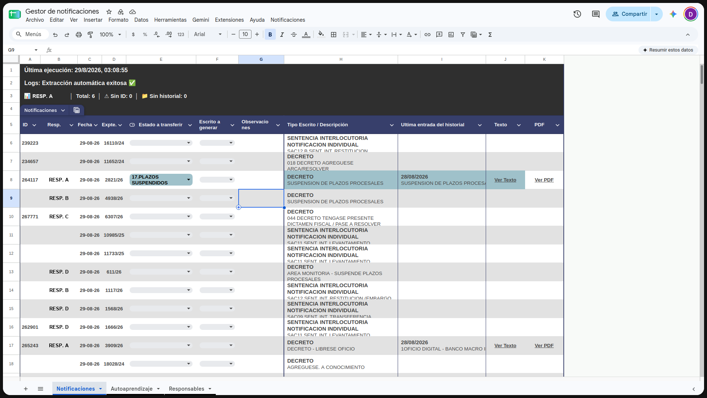
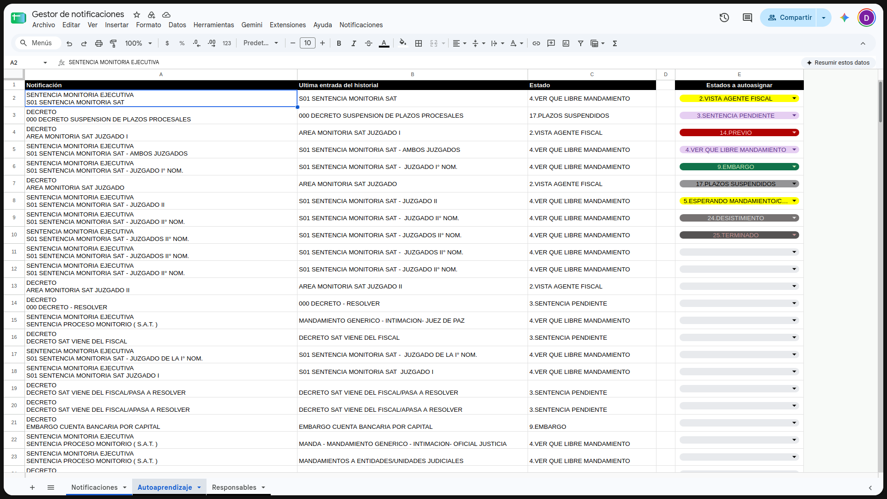
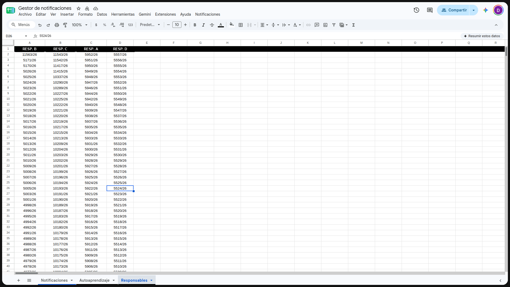

# Contexto de la planilla

Planilla: **Gestor de notificaciones** (Google Sheets).
Los scripts del repo (`Codigo.gs`, `WebApp.gs`) corren sobre esta planilla.
Capturas tomadas el 29/08/2026.

Pestañas: `Notificaciones` · `Autoaprendizaje` · `Responsables`

---

## Notificaciones



Hoja principal. La escribe `actualizarApremios()` / `etapaScrape()` / `etapaHistorial()`.

### Cabecera (filas 1-4)

| Celda | Contenido |
|-------|-----------|
| A1 | `Última ejecución: 29/8/2026, 03:08:55` — lo escribe `actualizarTimestamp()` |
| A2 | `Logs: Extracción automática exitosa ✅` — lo escribe `actualizarTimestamp()` |
| A3 | `📊 RESP. A \| Total: 6 \| ⚠️ Sin ID: 0 \| 📂 Sin historial: 0` — contadores |
| Fila 4 | Segmentador (slicer) sobre la tabla |
| Fila 5 | Encabezados |

Los datos arrancan en la **fila 6** (`CONFIG.FILA_INICIO = 6` en `WebApp.gs`).

### Columnas (fila 5)

| Col | Índice | Encabezado | Notas |
|-----|--------|------------|-------|
| A | 1 | ID | procID de consultaexpedientes. Lo completa la Web App (`saveProcids`) |
| B | 2 | Resp. | Responsable resuelto contra la hoja `Responsables`. Vacío = expte de nadie |
| C | 3 | Fecha | formato `dd-MM-yy` en pantalla; el código la normaliza a `dd/MM/yyyy` |
| D | 4 | Expte. | ej. `2821/26` |
| E | 5 | Estado a transferir | desplegable; lo autoasigna `asignarEstadosFinal()` |
| F | 6 | Escrito a generar | desplegable; el marcador `Test` dispara `transferirEstadosEspacioSat()` |
| G | 7 | Observaciones | manual; se copia a Espacio SAT |
| H | 8 | Tipo Escrito / Descripción | 2 líneas: título en negrita + descripción (rich text) |
| I | 9 | Ultima entrada del historial | 2 líneas: fecha + descripción (rich text) |
| J | 10 | Texto | `=HYPERLINK(...;"Ver Texto")` al PDF generado desde la lupa |
| K | 11 | PDF | `=HYPERLINK(...;"Ver PDF")` al adjunto bajado a Drive |

Solo se procesa historial/PDF de las filas con `Resp. = RESP. A` y fecha igual a la fecha objetivo.

---

## Autoaprendizaje



Tabla de mapeo que alimenta `cargarSettingsEstados()` y crece con `actualizarAutoaprendizaje()`.

| Col | Índice | Encabezado | Uso en el código |
|-----|--------|------------|------------------|
| A | 1 | Notificación | `desc` — igual a la col H de Notificaciones (2 líneas) |
| B | 2 | Ultima entrada del historial | `ultEntrada` — igual a la col I, sin la línea de fecha |
| C | 3 | Estado | `estado` a asignar cuando A y B matchean |
| D | 4 | — | vacía (separador) |
| E | 5 | Estados a autoasignar | lista blanca de estados; solo estos se asignan |

`cargarSettingsEstados()` lee desde la **fila 1** (el encabezado se descarta solo, porque el literal `Estado` no está en la lista blanca de la col E).

Ejemplo (fila 2):
- A: `SENTENCIA MONITORIA EJECUTIVA` / `S01 SENTENCIA MONITORIA SAT`
- B: `S01 SENTENCIA MONITORIA SAT`
- C: `4.VER QUE LIBRE MANDAMIENTO`

La col E lleva formato condicional por color (mismo esquema que `aplicarColorPorEstado()`).

---

## Responsables



Una columna por responsable; debajo, sus expedientes. Todo se genera por fórmula desde la planilla externa.

- Fila 1: nombres (`RESP. B`, `RESP. C`, `RESP. A`, `RESP. D`)
- Filas 2+: expedientes de ese responsable (`5952/26`, `11543/26`, …)

`cargarResponsables()` arma el mapa `expte -> [nombres]` recorriendo columnas.

### Fórmula A1 — nombres de responsables

```
=TRANSPOSE(UNIQUE(FILTER(IMPORTRANGE("<ESPACIO_SAT_SPREADSHEET_ID>", "'Hoja 2'!F2:F"), IMPORTRANGE("<ESPACIO_SAT_SPREADSHEET_ID>", "'Hoja 2'!F2:F") <> "")))
```

### Fórmula A2:D2 — expedientes por responsable

Una por columna; `val` apunta al nombre de la fila 1 de esa misma columna (A1 en A2, B1 en B2, etc.).

```
=LET(
  val, A1,
  id, "<ESPACIO_SAT_SPREADSHEET_ID>",

  datos_h1, IFERROR(IMPORTRANGE(id, "Hoja1!A:J"), {"","","","","","","","","",""}),
  datos_h2, IFERROR(IMPORTRANGE(id, "Hoja 2!A:J"), {"","","","","","","","","",""}),

  datos_unificados, VSTACK(
    CHOOSECOLS(datos_h1, 5, 10),
    CHOOSECOLS(datos_h2, 1, 6)
  ),

  expedientes, INDEX(datos_unificados,, 1),
  responsables, INDEX(datos_unificados,, 2),

  resultado, IFERROR(FILTER(expedientes, responsables = val), "No hay coincidencias"),
  UNIQUE(resultado)
)
```

Origen de datos: planilla **Espacio SAT**, ID `<ESPACIO_SAT_SPREADSHEET_ID>`.
- `Hoja1!E` = expediente, `Hoja1!J` = responsable
- `Hoja 2!A` = expediente, `Hoja 2!F` = responsable

Es la misma planilla a la que escribe `transferirEstadosEspacioSat()` (pestaña `Hoja 2`, ID guardado en la propiedad `ESPACIO_SAT_ID`).

---

## Hojas que el código crea solo

- `procID_database` — cache `expte -> procID` (`actualizarProcIDDatabase()` / `cargarProcIDDatabase()`)
